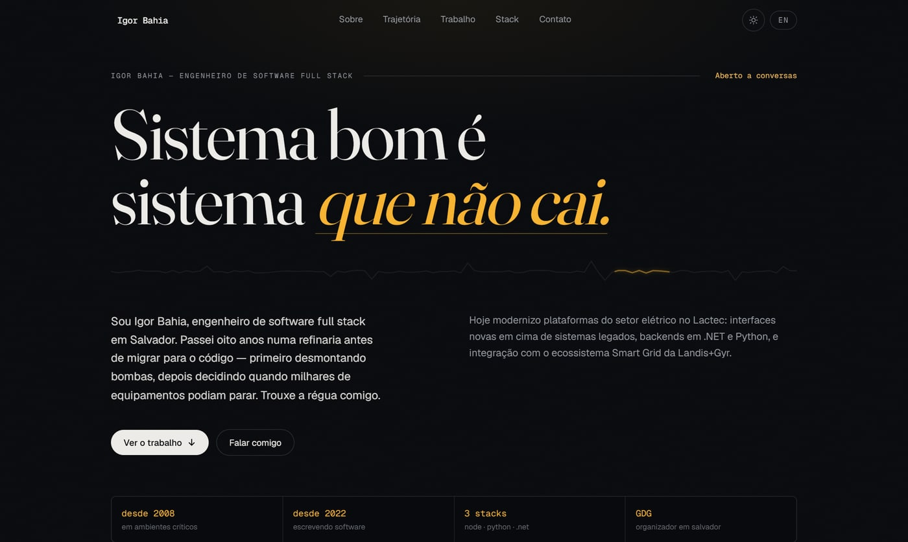

[Português](README.md) | English

# Portfolio — Igor Bahia

Personal site of Igor Bahia, software engineer. It presents the path — from industrial maintenance to software — and a selection of projects, in Portuguese and English.



[](https://github.com/igorjba/portfolio/actions/workflows/ci.yml)

Production: [portfolio-igorjba.vercel.app](https://portfolio-igorjba.vercel.app) · Portuguese: [/](https://portfolio-igorjba.vercel.app)

## Overview

The site is a Next.js application generated as static content: every route is prerendered at build time and served as HTML, with no runtime server function. There are two complete versions — Portuguese at the root (`/`) and English at `/en` — each with its own `<html lang>`, `canonical` and `hreflang`, independently indexable.

All content — copy, experience, projects — lives typed in a single module, `content/site.ts`, with the `pt` and `en` variants side by side. Components read from that module; there is no loose text in the JSX. A content change is a change to that file.

This document describes the structure and the decisions behind it. The non-obvious choices — why static, why no animation library, why the security policy differs between development and production — are in [Architecture](#architecture) and [Alternatives considered](#alternatives-considered).

## Running it

Requires Node 24.

```bash
npm install
npm run dev        # http://localhost:3000
```

Other commands:

```bash
npm run build      # production build (static output)
npm run start      # serve the build
npm run lint       # eslint
npm run typecheck  # tsc --noEmit
```

`NEXT_PUBLIC_SITE_URL` (optional) pins the base URL used in metadata, sitemap and Open Graph. On Vercel it falls back to the production domain; in development, to `localhost`.

## Architecture

```text
app/
  (pt)/            Portuguese route at the root (/)
  (en)/en/         English route (/en)
  sitemap.ts, robots.ts, icon.svg
components/        sections and UI (server components + client islands)
content/site.ts    all content, typed and bilingual
lib/               fonts, metadata/SEO, OG generator, trace generator
public/            images (project screenshots, photo)
assets/fonts/      TTFs used only to generate the OG images
```

Structural points:

- **Bilingual by route, no runtime i18n.** Each language is a *route group* with its own root layout, which allows a distinct `<html lang>` per language. These are two real static pages, not one page swapping strings on the client.
- **Server components by default.** Client JavaScript exists only where there is interaction: navigation, theme toggle, the timeline rail that fills on scroll, and the observer that reveals sections.
- **CSS reveals.** Entrance animations are CSS keyframes coordinated by a single `IntersectionObserver`. The hidden state lives behind a class applied when JavaScript is present; without JavaScript, the content is served in full (see [Alternatives considered](#alternatives-considered)).
- **Light and dark theme.** An inline script applies the saved theme before the first paint — no flash — and the choice is persisted in `localStorage`; dark is the default. Colors are tokens that swap by `[data-theme]`.
- **Open Graph per route.** Share images are generated by `next/og` from the local fonts in `assets/fonts/`, one per language.
- **Security headers** in `next.config.ts`: `Content-Security-Policy`, `Strict-Transport-Security`, `X-Content-Type-Options`, `Referrer-Policy`, `X-Frame-Options` and `Permissions-Policy`.

Stack: Next.js 16 (App Router), React 19, TypeScript in strict mode, Tailwind CSS v4 (configured in CSS, no `tailwind.config`) and `next/font` for the self-hosted fonts (Fraunces, Geist, Geist Mono). Deployed on Vercel.

## Alternatives considered

- **Route groups with two root layouts, instead of a dynamic `[lang]` route or runtime i18n.** `<html lang>` can only be set in a root layout, and a dynamic `app/[lang]` route would put Portuguese at `/pt`, not the root. Route groups keep Portuguese at `/` and English at `/en`, each with its own layout and `lang`, both static.
- **CSS + `IntersectionObserver`, instead of an animation library.** A library ships JavaScript to the client and, if it fails or lags, can leave content stuck invisible. Here the hidden state depends on a class that only exists with JavaScript active; without it, the text is served visible. The animation dependency was removed.
- **`next/image` without optimization (`unoptimized`), instead of on-demand optimization.** On-demand optimization runs as a function and has a quota on the host's free tier. Serving images straight from the CDN keeps the site fully static, at the cost of not producing responsive variants — acceptable for a few already-small images.
- **CSP conditional between development and production, instead of a nonce.** In production the policy disallows `eval`; in development, `unsafe-eval` is allowed because Turbopack uses it for HMR. A per-request nonce would require dynamic middleware and break the static output. With no user input and no reflected content, the XSS surface is essentially nil.

## Verification

Every push to the main branch runs through [CI](.github/workflows/ci.yml), which runs the same locally available commands:

```bash
npm run typecheck   # tsc --noEmit, strict mode
npm run lint        # eslint (next/core-web-vitals + next/typescript)
npm test            # vitest — pure functions (language routing, metadata, trace determinism)
npm run build       # fails if any route does not generate
```

The tests cover pure logic, not the UI: `pathFor` and `metadataFor` (per-language mapping and canonical), `personJsonLd` (author profiles), `isLang`, and the determinism of `buildTracePath` — which guarantees the same trace on server and client, with no hydration mismatch. Accessibility, no-JavaScript degradation and responsiveness are verified manually (see [Limitations](#limitations)).

## Limitations

- **Tests limited to pure logic.** Accessibility, no-JavaScript degradation and responsiveness were checked manually during development; there is no UI test proving them on each commit.
- **Content in code.** Copy and projects are edited in `content/site.ts`; there is no CMS.
- **Images served without resizing.** A consequence of the static output (see [Alternatives considered](#alternatives-considered)).

## License

© Igor Bahia. All rights reserved.
